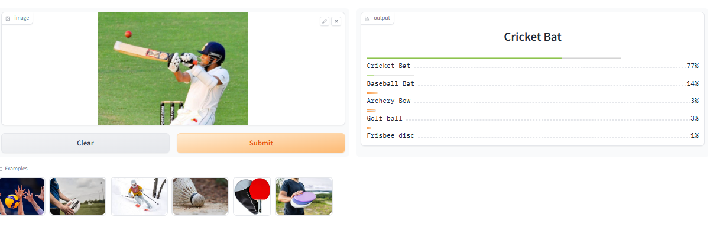
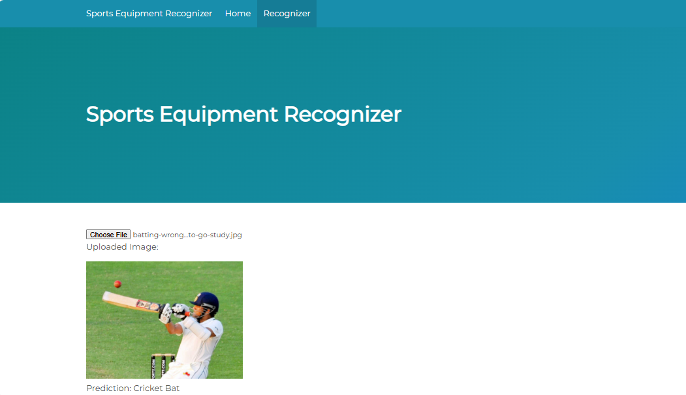

# Sports Equipment Recognizer

## Project Overview
The **Sports Equipment Recognizer** is a deep learning project that uses **fastai** and a **ResNet34 model** to classify images of 20 different sports equipment types. This project aims to help users identify various sports items based on images, which could be useful for sports enthusiasts, retailers, and educational purposes.

## Goal
The main objective of this project is to classify 20 widely used sports equipment items into their respective categories with high accuracy. The types of sports equipment include:
- Soccer Ball
- Basketball
- Tennis Racket
- Baseball Bat
- Cricket Bat
- Hockey Stick
- Volleyball
- Badminton Shuttlecock
- Table Tennis Paddle
- Rugby Ball
- Golf Ball
- Bowling Ball
- Skateboard
- Ski Poles
- Ice Skates
- Frisbee Disc
- Carrom Board
- Archery Bow
- Boxing Gloves
- Chessboard

## Dataset Preparation
### Data Collection
Images were collected using search queries on **DuckDuckGo**. Each type of equipment was queried individually, resulting in a dataset of thousands of images.

### DataLoader and Augmentation
- **DataLoader**: The `DataBlock` API from fastai was used to organize and load data efficiently.
- **Data Augmentation**: fastai’s data augmentation was applied, including rotation, zooming, and flipping, to make the model more robust to various orientations and conditions.

For detailed data preparation steps, see the notebook at `notebooks/data_preparation.ipynb`.

## Model Training and Data Cleaning
### Training
The model was trained using **ResNet34** architecture, which provided a balance between accuracy and computational efficiency. After a few training iterations, we achieved an accuracy of approximately 97%.

### Data Cleaning
The initial dataset contained some irrelevant images. To address this:
1. **ImageClassifierCleaner** from fastai was used iteratively to remove noisy images and correct misclassifications.
2. The data was refined after each training phase until reaching a satisfactory model version.

## Model Deployment
The trained model was deployed as an interactive app on **Hugging Face Spaces** using **Gradio**. Users can upload an image of sports equipment to receive a prediction of its category.

- [Hugging Face Deployment](https://huggingface.co/spaces/ahmedtanvir47/sport-recognizer/)

## API Integration with GitHub Pages
The deployed model API is accessible on a **GitHub Pages** site, allowing users to interact with the model via a web interface. This API integration showcases how the model can be utilized in a real-world application, making it accessible to non-technical users.

- [GitHub Pages Site](https://ahmedtanvir47.github.io/Sports-Equipment-Recognizer/)

## Results and Conclusion
This project demonstrates the ability to accurately classify sports equipment images using deep learning techniques. The deployment on Hugging Face and integration with GitHub Pages make the model accessible and easy to use, providing a valuable tool for sports enthusiasts and educational use.
